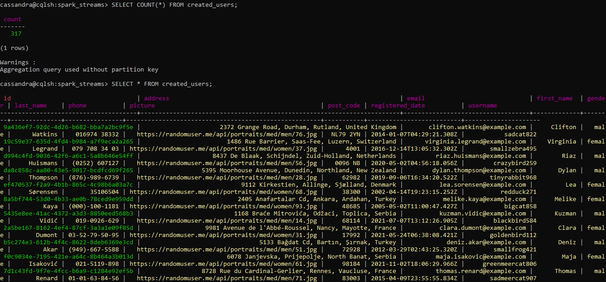
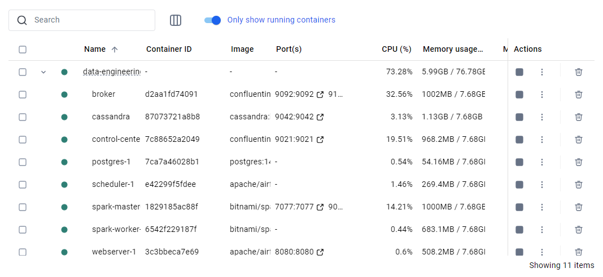

# Realtime Data Streaming | End-to-End Data Engineering Project 

## Table of Contents
- [Introduction](#introduction)
- [System Architecture](#system-architecture)
- [Key Steps](#key-steps)
- [Technologies](#technologies)
- [Getting Started](#getting-started)
- [Run Instructions](#run-instructions)
- [Watch the Video Tutorial](#watch-the-video-tutorial)

## Introduction

This project serves as a comprehensive guide to building an end-to-end data engineering pipeline. It covers each stage from data ingestion to processing and finally to storage, utilizing a robust tech stack that includes Apache Airflow, Python, Apache Kafka, Apache Zookeeper, Apache Spark, and Cassandra. Everything is containerized using Docker for ease of deployment and scalability.

## System Architecture


The project is designed with the following components:

- **Data Source**: We use `randomuser.me` API to generate random user data for our pipeline.
- **Apache Airflow**: Responsible for orchestrating the pipeline and storing fetched data in a PostgreSQL database.
- **Apache Kafka and Zookeeper**: Used for streaming data from PostgreSQL to the processing engine.
- **Control Center and Schema Registry**: Helps in monitoring and schema management of our Kafka streams.
- **Apache Spark**: For data processing with its master and worker nodes.
- **Cassandra**: Where the processed data will be stored.

## Cassandra Database

Below is a screenshot of the Cassandra database showing the stored streaming data:



## Docker Setup

Here is a screenshot of the running Docker containers:




## Key Steps

- Setting up a data pipeline with Apache Airflow
- Real-time data streaming with Apache Kafka
- Distributed synchronization with Apache Zookeeper
- Data processing techniques with Apache Spark
- Data storage solutions with Cassandra and PostgreSQL
- Containerizing your entire data engineering setup with Docker

## Technologies

- Apache Airflow
- Python
- Apache Kafka
- Apache Zookeeper
- Apache Spark
- Cassandra
- PostgreSQL
- Docker

## Run Instructions

### Step 1: Start Docker Compose

Run the following command to start the entire data engineering stack:

```bash
docker-compose up -d
```

### Step 2: Copy the Spark Streaming Script

After the containers are up and running, copy the `spark_stream.py` file into the Spark master container:

```bash
docker cp spark_stream.py data-engineering-spark-master-1:/tmp/
```

### Step 3: Execute the Spark Streaming Job

Access the Spark master container:

```bash
docker exec -it data-engineering-spark-master-1 bash
```

Inside the container, run the following command to execute the Spark streaming job:

```bash
spark-submit \
  --master spark://data-engineering-spark-master-1:7077 \
  --packages org.apache.spark:spark-sql-kafka-0-10_2.12:3.4.1,com.datastax.spark:spark-cassandra-connector_2.12:3.4.1 \
  --conf spark.cassandra.connection.host=cassandra \
  --conf spark.cassandra.connection.port=9042 \
  --conf spark.sql.extensions=com.datastax.spark.connector.CassandraSparkExtensions \
  --conf spark.kafka.bootstrap.servers=broker:9092 \
  --conf spark.driver.host=data-engineering-spark-master-1 \
  --conf spark.driver.bindAddress=0.0.0.0 \
  /tmp/spark_stream.py
```
